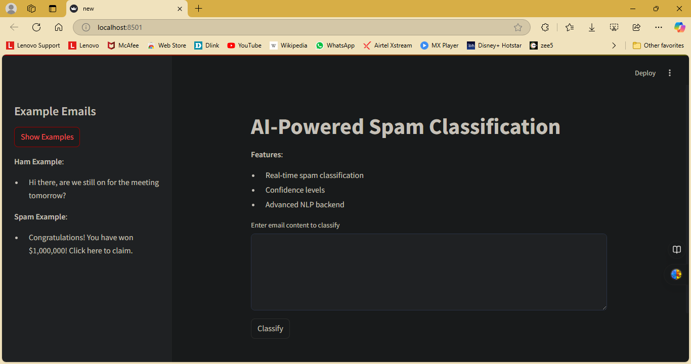

# AI-Powered Spam Classification System

This project is an **AI-Powered Spam Classification System** that classifies emails as either **Spam** or **Not Spam** using advanced natural language processing (NLP) techniques. The project includes a robust backend for training and evaluating the spam classifier and an intuitive frontend for real-time email classification.

---

## 🚀 Features

- **Real-Time Classification**: Classify email content as Spam or Not Spam.
- **Confidence Levels**: Provides confidence scores for predictions.
- **Advanced Machine Learning**: Utilizes Gradient Boosting Classifier for high accuracy.
- **Natural Language Processing**: Preprocessing with TF-IDF and lemmatization for efficient text analysis.
- **Balanced Dataset**: SMOTE (Synthetic Minority Oversampling Technique) is used for handling class imbalance.

---

## 📂 Project Structure

### Backend
The backend code handles:
1. **Data Preprocessing**:
   - Text cleaning (removing noise, stopwords, and special characters).
   - Lemmatization for word normalization.
   - Vectorization using **TF-IDF**.

2. **Model Training**:
   - Training a **Gradient Boosting Classifier** with a balanced dataset.
   - Dataset balancing using **SMOTE**.

3. **Evaluation**:
   - Reports accuracy, F1-score, and classification metrics.
   - Outputs the model and vectorizer as `pickle` files.

4. **Dependencies**:
   - `pandas`, `numpy`, `nltk`, `scikit-learn`, `imblearn`.

### Frontend
The frontend is a user-friendly **Streamlit** application:
- Takes user input (email content).
- Classifies the email in real-time.
- Displays results with confidence levels.
- Sidebar for example emails.

---

## 🛠️ Installation and Setup

### Prerequisites
- Python 3.7 or above
- Required libraries (install using `requirements.txt`).

### Steps
1. Clone the repository.
   ```bash
   git clone https://github.com/KOTAHARSHA25/spam-classification.git
   cd spam-classification
   ```

2. Install dependencies.
   ```bash
   pip install -r requirements.txt
   ```

3. Run the backend script to train the model.
   ```bash
   python backend.py
   ```

4. Start the frontend Streamlit app.
   ```bash
   streamlit run frontend.py
   ```

---

## 📊 Dataset

- **Dataset**: The Spam Email Dataset is included in the project files.
- **Description**:
  - **Columns**: `label`, `message`.
  - **Labels**: `ham` (Not Spam), `spam` (Spam).

### Preprocessing Steps:
1. Text cleaning (removing special characters, stopwords).
2. Lemmatization using NLTK.
3. Vectorized using TF-IDF with bigram support.

---

## 🧪 Model Performance

- **Accuracy**: 98.34%
- **F1 Score**: 98.29%
- **Precision and Recall**:
  - Spam (`1`): Precision 99%, Recall 97%.
  - Not Spam (`0`): Precision 98%, Recall 99%.

---

## 💻 Technology Stack

1. **Frontend**:
   - **Streamlit**: Interactive web application for classification.

2. **Backend**:
   - **Python Libraries**: 
     - `pandas`, `numpy`, `scikit-learn`, `nltk`, `imblearn`.

3. **Model**:
   - **Gradient Boosting Classifier**:
     - Optimized with 200 estimators, learning rate 0.1, max depth 5.

---

## 📄 Example Usage

### Running the App
1. Start the Streamlit app:
   ```bash
   streamlit run frontend.py
   ```

2. Enter email content in the text area to classify.

### Example Input:
**Email Content**:
```text
Congratulations! You have won $1,000,000! Click here to claim.
```

**Output**:
```text
🚨 This is classified as SPAM with a confidence of 99.85%.
```

---

## 🖼️ Interface Screenshots

### 1. Interface
This is how the user interface of the app looks:


### 2. Success: Not Spam Detection
The email is classified as **Not Spam** with a confidence score:


### 3. Spam Detection
The email is classified as **Spam** with a confidence score:


---

## 🔧 Improvements

- **Add More Data**: To further enhance model generalization.
- **Deploy App**: Host the application on platforms like Heroku or AWS.
- **Add More Features**: Include attachments analysis and email sender reputation.

---

## 📝 License
This project is open-source and available under the MIT License.
